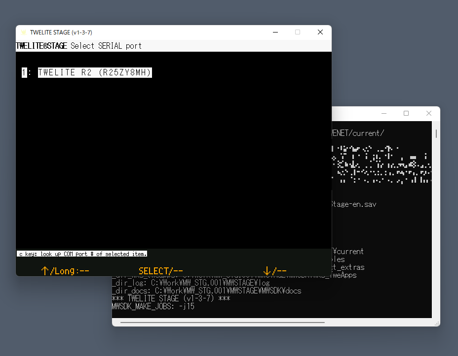

# How to use

This is an explanation of the TWELITE STAGE screen and operation methods.

## About Execution

To start the TWELITE STAGE application, execute the executable found in `{MWSTAGE Installation}`.

The execution method differs for each system (Windows, macOS, Linux).

| system | file extension | notes |
| -------- | ------     | ---- |
| Windows  | `.exe`     | Double-click on the executable in Explorer. |
| macOS    | `.command` | Double-click on the executable from the finder. |
| Linux, RaspberryPi | `.run`     | Depends on the distribution and installation environment; run as a command from a terminal screen (e.g., xterm) on an X window system. |

## About Executable

Two executables are available.

* TWELITE_Stage.{extension} - starts with default settings
* TWELITE_Stage_VSCode.{extension} - "Use VSCode" is already set (settings are stored in `TWELITE_Stage_VSCode.ini`). Enabling the Use VSCode setting will make the behavior suitable for development work using VSCode It will become


Although it is not an error to launch multiple TWELITE STAGE applications, there are some functions (such as the sensor graph function) that are infeasible when multiple applications are launched.

In this case, make a copy of the executable and launch it as a separate file name. The file names of the various settings and input/output files will be different and will not interfere with each other.


## About the Execution Screen

There are two types of running screens: one is the command screen (if started from the command screen, the same screen is used) and one is the main screen of TWELITE STAGE. The command screen is not normally used, although it is possible to check the operation and other auxiliary information.

