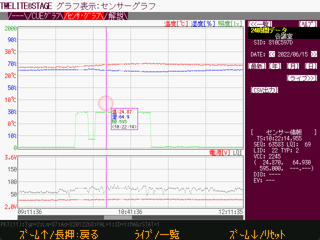

# センサーグラフ

`Windows` `macOS` `Linux`  `RasPi`

各種センサーデータをデータベースファイルに記録します。また TWELITE Stage 画面上で簡易的に計測値を参照する機能もあります。





同一実行形式名の TWELITE STAGE を複数起動して、センサーグラフを同時に使用することはできません。

データベースファイルは `{MWSTAGEインストール}/log` フォルダに格納され、TWELITE_Stage 実行形式名をもとにファイル名が決まります。同一実行形式の場合、同じデータベースファイルを参照するためです。TWELITE STAGE アプリの実装では、複数が同時にデータベースにデータ追加を行うことは想定していません。また、状況によってはデータベースファイルのアクセスエラーになり、TWELITE STAGE アプリがクラッシュする場合もあります。

例えば、MONOSTICK を２台つないで、同時に複数「センサーグラフ」を動作させたい場合は、各々別の実行形式名 (`stage_a.exe`, `stage_b.exe`) とした TWELITE STAGE アプリを実行します。この時のデータベースファイル名は `log/stage_a_WSns.sqlite`, `log/stage_b_WSns.sqlite` です。


* データの保存は sqlite3 を用い `{MW_STAGE Install}/log/{実行形式名}_WSns.sqlite` というファイルに格納されます。

* 画面遷移は [一覧(グラフプレビューあり)]>[２４時間データ] >[ライブビュー]です。

    * [２４時間データ] から更に [年] [月] [日(グラフプレビューあり)] 選択画面に遷移できます。

* [ライブ]表示画面について

    * 一覧から特定のノードを選択します。
    * １秒おきのリアルタイム表示を行い、過去450秒前までのデータを表示します。

* [２４時間データ] 表示画面について

    * 特定の日のデータを表示します。
    * １秒おきの取得とし、複数データが有る場合は間引かれます。
    * 最大拡大時（１ピクセル１秒）以外は、各ピクセル範囲での取得値の平均により表示します。
    * 値が画面よりはみ出す場合は上下端に測定点を表示します。
    * 現在時間が含まれる場合は、新しいデータが来ると表示更新します。
    * ホイール、カーソル↑↓：時間軸の拡大・縮小
    * マウスの移動：マウスポインタに対応する時間軸にある取得データを簡易表示します。
        * カーソル→、←：隣の取得データに移動します。
    * クリック&ドラッグ：スクロール（拡大時のみ）
    * 拡大時はスクロールバーによる操作も可能です。
    * [CSV出力] 機能では、データベースに含まれるすべての取得値を表示します。

* データの抽出は https://sqlitebrowser.org/ のツールを使ってください。

### 操作

|  操作                                 |  内容                                                        |
| ------------------------------------ | ------------------------------------------------------------ |
| マウスドラッグ（グラフ部分）         | 拡大時に表示位置を移動                                     |
| マウスドラッグ（下部スクロールバー） | 拡大時に位置を移動                                   |
| カーソル→, ←                         | サンプル表示の移動                                           |
| カーソル↑, ↓, ホイール                | サンプル横軸の拡大・縮小                                   |
| `[ライブ]`                           | 最新到着データを表示する1秒刻みビューに移動する |
| `[24時間データ]`                     | 1日単位グラフに移動する |
| `[<<一覧]`                          | 一覧選択画面に移動する |
| `[年]`　`[月]` `[日]`                | 年月日で、特定日を選択する |
| `[最新]`                             | 今日のデータに移動 |
| `[CSV出力]`                          | 1日分のデータをCSVファイルに出力 |
| 一覧で `[表示]`                      | リストの表示方式を変更する |
| 一覧で `[ソート]`                    | リストの並び順を変更する |
| 一覧で `[↑]`                        | リストの並び順を反転する |


### 画面遷移

画面は一覧、24時間、ライブの3種類が基本になります。

```
[一覧] <--> [24時間] <--> [ライブ]
              ↓↑
          [年月日選択]
```


### センサーグラフモードの起動時に開く

[STAGE 共通設定→起動アプリ指定]にて`32`を指定する。


### DBのテーブルについて

#### sensor_data

| カラム名      | 型                     | 解説                                                         |
| ------------- | ---------------------- | ------------------------------------------------------------ |
| `_uqid`       | INTEGER                | データベースで使用する続き番号                               |
| `sid`         | INTEGER<br />`int32_t` | `int32_t` 型で格納しているシリアル番号です。"8123abcd" というシリアル番号の場合は整数値で -2,128,368,691 の値が格納されます |
| `ts`          | INTEGER                | システムがパケットを受信した時刻で、`int64_t` 型で格納されるタイムスタンプ値です。UNIX epoch (エポック、1970年からの経過秒) です。 |
| `ts_msec`     | INTEGER                | タイムスタンプのミリ秒部分です。                             |
| `year`        | INTEGER                | タイムスタンプよりローカル時間の年部分です。                 |
| `month`       | INTEGER                | タイムスタンプよりローカル時間の月部分です。                 |
| `day`         | INTEGER                | タイムスタンプよりローカル時間の日部分です。                 |
| `hour`        | INTEGER                | タイムスタンプよりローカル時間の時部分です。                 |
| `lid`         | INTEGER                | ユーザにより割り当てられた LID などの識別値です。            |
| `lqi`         | INTEGER                | 受信強度の目安値です (Link Quality Indicator) 。             |
| `pkt_seq`     | INTEGER                | パケットの続き番号です。どのような値を取りうるのかはファームウェアによって異なります。 |
| `pkt_type`    | INTEGER                | 無線パケットの種別です。<br />`2 PAL AMB, 6 ARIA` <br />`1 PAL MAG` <br />`*3 PAL MOT,5 CUE` <br />`0x101 App_Twelite, *0x103 App_IO` <br />*現時点で非対応 |
| `value`       | REAL                   | 計測値 (パケット種別によって定義が異なります)<br />`pkt_type->`<br />` 2,6: 温度`<br />` 1: 磁石の判定有無 00->磁石なし, 01->N極, 02->S極`<br />` 3,5: X軸加速度(パケット中に複数サンプル含まれる場合は平均値)`[G]<br />` 0x101,103: 入力IOのビットマップ(val_dioの下位８ビットと同値)` |
| `value1`      | REAL                   | 計測値 (パケット種別によって定義が異なります)<br />`pkt_type->`<br />` 2,6: 湿度[%]`<br />` 1: 未使用`<br />` 3,5: Y軸加速度(パケット中に複数サンプル含まれる場合は平均値)[G]`<br />` 0x101: ADC1[V] ,103: 未使用` |
| `value2`      | REAL                   | 計測値 (パケット種別によって定義が異なります)<br />`pkt_type->`<br />` 2: 照度[lx], 6: 未使用`<br />` 1: 未使用`<br />` 3,5: Z軸加速度(パケット中に複数サンプル含まれる場合は平均値)`[G]<br />` 0x101: ADC2[V], 103: 未使用` |
| `value3`      | REAL                   | 計測値 (パケット種別によって定義が異なります)<br />`pkt_type->`<br />` 2: 未使用, 6: 未使用`<br />` 1: 未使用`<br />` 3,5: 未使用`<br />` 0x101: ADC3[V], 103: 未使用` |
| `val_vcc_mv`  | INTEGER                | 電圧[mV]                                                     |
| `val_dio`     | INTEGER<br />`int32_t` | b0..b7: DI1..DI8の値 (1はLO, 0はHIGHレベル)<br />b24..b25: マグネット値 (b28が1の場合), 00->磁石なし, 01->N極, 10->S極<br />b28: 1の場合マグネットデータがb24..b25に格納される<br />b31: 定期送信ビット(マグネットのみ) |
| `val_adc1_mv` | INTEGER                | `pkt_type`->1,2,3,0x101: ADC1の計測値                        |
| `val_adc2_mv` | INTEGER                | `pkt_type`->0x101: ADC4の計測値                              |
| `val_aux`     | INTEGER                | その他データ格納目的                                         |
| `ev_src`      | INTEGER                | イベント発生元                                               |
| `ev_id`       | INTEGER                | イベントID<br />`pal_type`->5: 1...6→サイコロ 16→MOVE ... 他(TWELITE CUE の資料参照) |
| `ev_param`    | INTEGER                | イベントパラメータ                                           |

#### sensor_node

センサーノードに付加情報（テキスト）を格納する目的で利用する。

| カラム名   | 型      | 解説                                                         |
| ---------- | ------- | ------------------------------------------------------------ |
| `sid`      | INTEGER | 上述のSID                                                    |
| `sid_text` | TEXT    | SIDを１６進数文字列に変換したもの（可読性のため）            |
| `desc`     | TEXT    | SIDに対応する補助情報で、一覧などで一緒に表示する。<br />※TWELITE STAGEでは、この部分を編集するインタフェースを用意していません。必要に応じて直接編集してください。 |

#### sensor_last

最後に受信したタイムスタンプを管理する目的で使用する。

| カラム名     | 型      | 解説                             |
| ------------ | ------- | -------------------------------- |
| `sid`        | INTEGER | 上述のSID                        |
| `ts`         | INTEGER | 最後の受信時のタイムスタンプ     |
| `lid`        |         | 以下、最後に受信時のデータの抜粋 |
| `lqi`        |         |                                  |
| `pkt_type`   |         |                                  |
| `value`      |         |                                  |
| `value1`     |         |                                  |
| `value2`     |         |                                  |
| `value3`     |         |                                  |
| `val_vcc_mw` |         |                                  |
| `val_dio`    |         |                                  |
| `ev_id`      |         |                                  |

